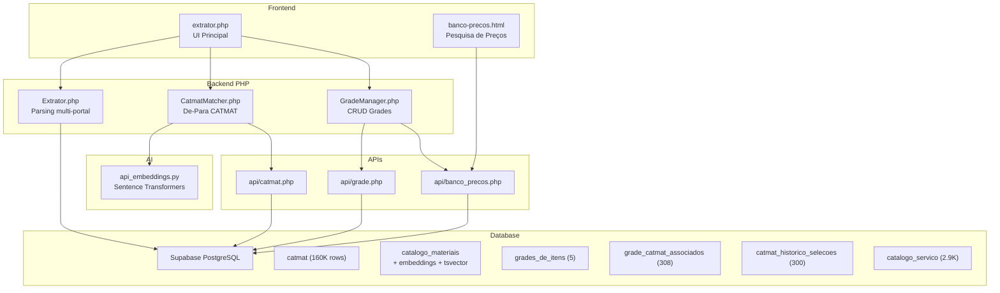
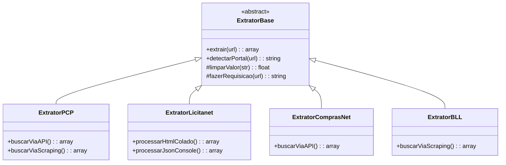
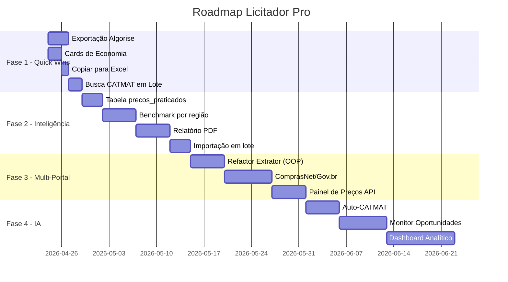

# 🎯 Análise Estratégica — Licitador Pro

## 1. Diagnóstico do Estado Atual

### Ecossistema de Componentes



### O que funciona bem ✅

| Componente | Status | Observação |
|-----------|--------|------------|
| Extração Portal de Compras Públicas | ✅ Estável | API v2 + fallback scraping |
| Extração Licitanet (Console) | ✅ Funcional | Script JS captura melhor lance |
| Extração Licitanet (HTML colado) | ✅ Funcional | Sem melhor lance (limitação) |
| De-Para CATMAT (pg_trgm) | ✅ Funcional | Busca por similaridade textual |
| De-Para CATMAT (Embeddings IA) | ✅ Funcional | Python local com fallback |
| Salvar Grade no Supabase | ✅ Funcional | CRUD completo |
| Banco de Preços Histórico | ⚠️ Básico | Busca funciona mas base pequena |
| Histórico de Seleções CATMAT | ✅ Passivo | 300 registros acumulados |

### Gaps Identificados 🔴

| Gap | Impacto | Prioridade |
|-----|---------|-----------|
| Sem exportação direta para Algorise | Alto | P0 |
| Sem coleta automática de preços de outros órgãos | Alto | P1 |
| Sem dashboard/indicadores de licitações | Médio | P1 |
| Sem suporte a ComprasNet/Gov.br | Alto | P2 |
| Sem relatório de pesquisa de preços (PDF) | Alto | P1 |
| Sem histórico de economia (lance vs referência) | Médio | P2 |
| Sem alerta de novas licitações por segmento | Médio | P3 |
| Sem integração com BEC (Bolsa Eletrônica de Compras SP) | Baixo | P3 |

---

## 2. Roadmap Estratégico

### Fase 1 — Quick Wins (1-2 semanas)
> Funcionalidades que geram valor imediato com pouco esforço

#### 1.1 🔗 Exportação Direta para Algorise
Gerar arquivo CSV/JSON no formato exato que o Algorise espera para importação de grade.

```
Botão "Exportar para Algorise" → Gera arquivo com:
- Item, Descrição, CATMAT, Qtd, Und, Valor Ref, Melhor Lance
```

**Onde implementar:** Novo botão no `extrator.php` após salvar a grade.

#### 1.2 📊 Cards de Economia no Extrator
Adicionar métricas visuais no topo da tabela de resultados:

| Card | Cálculo |
|------|---------|
| 💰 Valor Total Estimado | Σ (qtd × valor_referencia) |
| 🏆 Valor Total Melhor Lance | Σ (qtd × melhor_lance) |
| 📉 Economia Potencial | Estimado - Melhor Lance |
| 📈 % de Desconto Médio | ((Estimado - Lance) / Estimado) × 100 |

#### 1.3 📋 Copiar Tabela para Excel
Botão que copia a tabela inteira em formato tab-separated (colável no Excel/Google Sheets).

#### 1.4 🔍 Busca CATMAT em Lote (Auto-All)
Botão "Buscar CATMAT para Todos" que dispara a busca para todos os itens simultaneamente com barra de progresso.

---

### Fase 2 — Motor de Inteligência de Preços (2-4 semanas)
> Transformar o sistema numa referência de preços praticados

#### 2.1 📈 Benchmark de Preços por Região/Órgão

Nova tabela no Supabase:

```sql
CREATE TABLE public.precos_praticados (
    id bigint GENERATED ALWAYS AS IDENTITY PRIMARY KEY,
    codigo_catmat bigint,
    descricao_item text NOT NULL,
    orgao text NOT NULL,
    uf char(2),
    cidade text,
    portal_origem text,   -- 'Licitanet', 'PCP', 'ComprasNet', etc.
    url_edital text,
    numero_processo text,
    data_licitacao date,
    quantidade numeric DEFAULT 1,
    unidade varchar DEFAULT 'UN',
    valor_referencia numeric,
    valor_vencedor numeric,
    percentual_desconto numeric GENERATED ALWAYS AS (
        CASE WHEN valor_referencia > 0 
        THEN ROUND(((valor_referencia - valor_vencedor) / valor_referencia) * 100, 2)
        ELSE 0 END
    ) STORED,
    created_at timestamptz DEFAULT now()
);

CREATE INDEX idx_precos_catmat ON precos_praticados(codigo_catmat);
CREATE INDEX idx_precos_uf ON precos_praticados(uf);
CREATE INDEX idx_precos_data ON precos_praticados(data_licitacao DESC);
```

**Impacto:** Ao consultar um item, o usuário vê:
- Preço médio praticado no Brasil
- Preço médio na região (UF)
- Faixa de preços (mín/máx)
- Tendência (últimos 6 meses)

#### 2.2 📑 Relatório de Pesquisa de Preços (PDF)

> [!IMPORTANT]
> Este é um dos documentos mais exigidos em licitações públicas. Gerar automaticamente é um diferencial competitivo enorme.

**Formato do relatório:**
```
┌─────────────────────────────────────────────┐
│ PESQUISA DE PREÇOS DE MERCADO               │
│ (Art. 23, Lei 14.133/2021)                  │
├─────────────────────────────────────────────┤
│ Órgão: Prefeitura Municipal de XYZ          │
│ Processo: 001/2026                          │
│ Objeto: Aquisição de Material de Expediente │
├─────────────────────────────────────────────┤
│ Item 1: Caneta Esferográfica Azul           │
│ CATMAT: 150242                              │
│ Qtd: 1000 UN                               │
│                                             │
│ Fonte 1: Portal Compras Públicas            │
│   Órgão: Pref. ABC - R$ 1,25               │
│ Fonte 2: Licitanet                          │
│   Órgão: Pref. DEF - R$ 1,18               │
│ Fonte 3: Painel de Preços Gov.br            │
│   Média Nacional - R$ 1,30                  │
│                                             │
│ Média: R$ 1,24 | Mediana: R$ 1,25           │
│ Valor Adotado: R$ 1,25                      │
└─────────────────────────────────────────────┘
```

**Tecnologia:** `dompdf` ou `TCPDF` (PHP puro, sem dependências externas).

#### 2.3 🔄 Importação em Lote de Licitações Encerradas

Funcionalidade para "popular o banco" com dados de licitações já encerradas:
1. Usuário abre lista de sessões encerradas no portal
2. Executa script do console que varre a página e extrai múltiplas sessões
3. O sistema salva automaticamente todos os itens + lances vencedores na tabela `precos_praticados`

---

### Fase 3 — Multi-Portal (4-6 semanas)
> Expandir para outros portais de licitação

#### 3.1 Portais Prioritários

| Portal | Cobertura | Dificuldade | Método |
|--------|-----------|-------------|--------|
| **ComprasNet (Gov.br)** | Federal | Média | API pública |
| **Painel de Preços** | Nacional | Baixa | API REST |
| **BLL Compras** | Regional | Média | Scraping |
| **Licitar Digital** | Regional | Média | Scraping |
| **BEC (SP)** | Estadual SP | Alta | Web Service |
| **Compras.gov.br** | Federal | Baixa | API v2 pública |

#### 3.2 Arquitetura Multi-Portal



#### 3.3 API do Painel de Preços do Governo Federal

> [!TIP]
> O **Painel de Preços** (paineldeprecos.planejamento.gov.br) oferece dados públicos de compras federais via API REST. É a fonte mais confiável para pesquisa de preços.

```
GET /api/v1/materiais/{catmat}/precos
→ Retorna todos os preços praticados por órgãos federais para aquele CATMAT
```

**Integração:** Ao buscar um CATMAT no extrator, automaticamente consultar o Painel de Preços e exibir a média nacional como referência.

---

### Fase 4 — Inteligência Avançada (6-12 semanas)
> IA e automação para vantagem competitiva

#### 4.1 🤖 Auto-CATMAT com Confiança

Aproveitar o `catmat_historico_selecoes` (300 registros) para auto-atribuir CATMAT:

```
Se a descrição do portal JÁ foi mapeada antes (score > 0.95):
  → Atribui automaticamente com badge "✅ Auto"
  → Não precisa clicar "Buscar CATMAT"

Se similaridade > 0.80:
  → Sugere com badge "🔄 Sugerido"
  → Pré-seleciona mas permite alterar

Se < 0.80:
  → Badge "⚠️ Revisar"
  → Busca manual
```

#### 4.2 📡 Monitor de Oportunidades

Tarefa agendada (n8n ou cron) que:
1. Monitora portais para novos editais publicados
2. Filtra por palavras-chave do segmento do usuário
3. Envia alerta (email/Telegram/WhatsApp) com resumo:

```
🔔 Nova Licitação Detectada!
📋 Pref. São Paulo - PE 123/2026
📦 Material de Expediente (11 itens)
💰 Valor Estimado: R$ 45.000,00
🗓️ Sessão: 30/04/2026 às 09:00
🔗 https://licitanet.com.br/sessao/17999
```

#### 4.3 📊 Dashboard Analítico

Painel com:
- **Top 10 itens mais licitados** (por CATMAT)
- **Economia gerada** (diferença entre referência e lance vencedor)
- **Mapa de calor** por UF (preços por região)
- **Tendência de preços** (últimos 12 meses)
- **Órgãos mais ativos** (volume de compras)

---

## 3. Proposta de Priorização



---

## 4. Ações Imediatas Recomendadas

> [!CAUTION]
> A chave `SUPABASE_KEY` está hardcoded em `config/database.php`. Em produção (Coolify), use variáveis de ambiente. Nunca commite credenciais no repositório.

### Implementar agora (esta sessão):

1. **Exportação CSV para Algorise** — Botão que gera CSV no formato do Algorise
2. **Cards de economia** — Mostrar Valor Total Melhor Lance + % de desconto
3. **Botão "Copiar para Excel"** — Copia tabela em formato tab-separated

### Implementar esta semana:

4. **Busca CATMAT em lote** — Botão "Auto-atribuir todos"
5. **Tabela `precos_praticados`** — Schema no Supabase
6. **Alimentar banco automaticamente** — Ao salvar grade, popular `precos_praticados`

---

## 5. Visão de Produto Final

```
┌──────────────────────────────────────────────────┐
│                LICITADOR PRO                     │
│         Plataforma de Inteligência em            │
│           Licitações Públicas                    │
├──────────────────────────────────────────────────┤
│                                                  │
│  📥 CAPTURA         Extrai itens de qualquer     │
│                     portal (PCP, Licitanet,      │
│                     ComprasNet, BLL...)           │
│                                                  │
│  🏷️ CLASSIFICAÇÃO   CATMAT automático com IA     │
│                     (embeddings + histórico)      │
│                                                  │
│  💰 PRECIFICAÇÃO    Benchmark nacional por CATMAT │
│                     Relatório de pesquisa (PDF)   │
│                                                  │
│  📊 ANÁLISE         Dashboard de economia,       │
│                     tendências e oportunidades    │
│                                                  │
│  🔗 INTEGRAÇÃO      Exporta grade pronta para    │
│                     Algorise + banco de preços    │
│                                                  │
│  🔔 MONITORAMENTO   Alerta de novas licitações   │
│                     por segmento/região/CATMAT    │
│                                                  │
└──────────────────────────────────────────────────┘
```

> [!NOTE]
> Este sistema tem potencial para se tornar um **SaaS vertical** para empresas que participam de licitações. O mercado de compras públicas no Brasil movimenta ~R$ 800 bilhões/ano e há poucos players com inteligência de preços deste nível.
