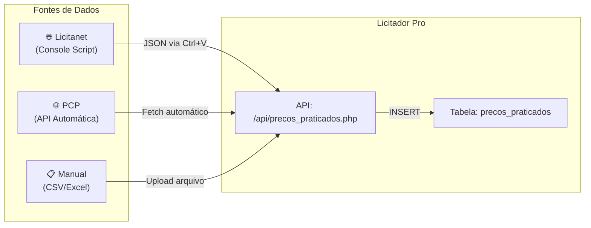
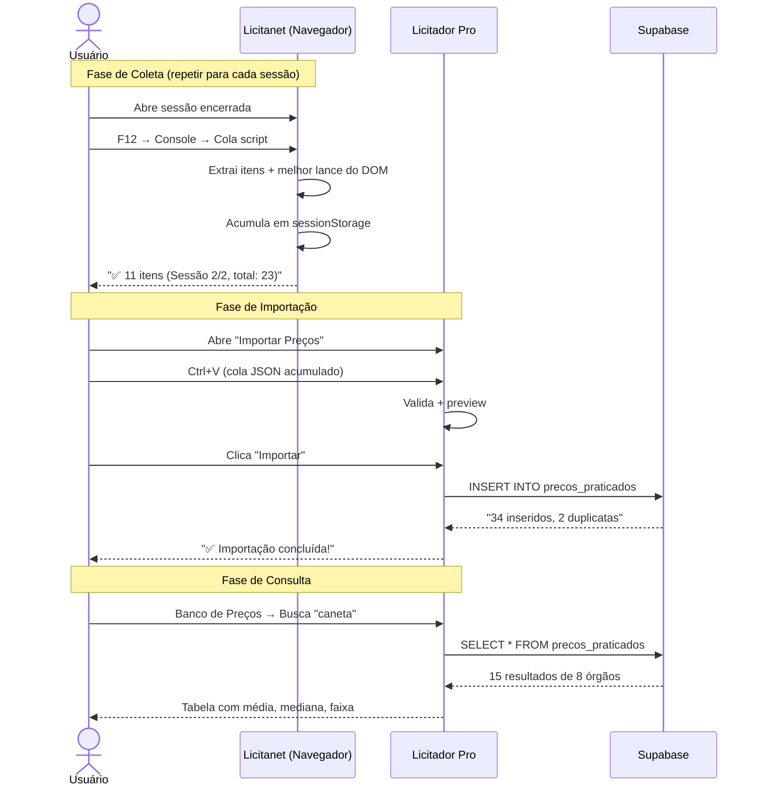

# 📦 Importação em Lote de Licitações Encerradas

## O Problema
Para montar um banco de preços útil (benchmark, pesquisa de mercado, orçamento), é preciso ter centenas/milhares de registros de compras já realizadas. Inserir manualmente é inviável.

## A Solução: 3 Caminhos de Importação



---

## Caminho 1: Licitanet (Via Console do Navegador)

### Por que não pode ser 100% automático?
- A Licitanet bloqueia IPs de servidor (WAF)
- O "Melhor Lance" só existe no DOM renderizado (não no HTML fonte)
- Portanto: **precisa do navegador do usuário**

### Fluxo do Usuário

```
┌─────────────────────────────────────────────────────────┐
│ PASSO 1: Abrir sessão encerrada na Licitanet            │
│          https://www.licitanet.com.br/sessao/17685      │
│                                                         │
│ PASSO 2: F12 → Console → Colar script → Enter           │
│          "✅ 11 itens capturados! (Sessão 1/1)"          │
│          "📋 Dados copiados para a área de transferência" │
│                                                         │
│ PASSO 3: Abrir Licitador Pro → Importar Preços           │
│          Ctrl+V → Colar dados → "Salvar no Banco"        │
│                                                         │
│ OU (Modo Lote):                                          │
│                                                         │
│ PASSO 2b: Abrir outra sessão → Colar script → Enter     │
│           "✅ 8 itens capturados! (Sessão 2 acumulada)"  │
│           Repetir para quantas sessões quiser...          │
│                                                         │
│ PASSO 3b: Quando terminar, rodar script final:           │
│           copiarTudo()                                    │
│           "📋 45 itens de 5 sessões copiados!"            │
└─────────────────────────────────────────────────────────┘
```

### Script do Console (Com Acumulação em sessionStorage)

```javascript
// === LICITADOR PRO - Coletor de Preços em Lote ===
(function(){
    // Extrai dados da página atual
    var d = JSON.parse(document.getElementById('app').getAttribute('data-page'));
    var r = d.props.disputeRoom;
    var items = r.items.data || r.items;

    // Captura melhor lance do DOM renderizado
    var lances = [];
    document.querySelectorAll('p').forEach(function(p){
        if(p.textContent.trim() === 'Melhor Lance'){
            var v = p.nextElementSibling;
            if(v) lances.push(v.textContent.trim());
        }
    });

    // Monta os itens desta sessão
    var sessaoAtual = {
        sessao_id: r.id || window.location.pathname.split('/').pop(),
        orgao: r.buyer,
        objeto: r.description,
        numero_processo: r.number,
        data_sessao: r.startDate,
        portal: 'Licitanet',
        url: window.location.href,
        itens: items.map(function(it, i){
            return {
                descricao: it.name,
                quantidade: it.quantity,
                unidade: it.unit,
                valor_referencia: it.estimatedValue,
                melhor_lance: lances[i] || 'R$ 0,00',
                numero_item: it.batch
            };
        })
    };

    // Acumula no sessionStorage (persiste entre navegações na mesma aba)
    var acumulado = JSON.parse(sessionStorage.getItem('licitador_lote') || '[]');
    
    // Evita duplicata (mesma sessão)
    var idx = acumulado.findIndex(s => s.sessao_id == sessaoAtual.sessao_id);
    if(idx >= 0) acumulado[idx] = sessaoAtual;
    else acumulado.push(sessaoAtual);
    
    sessionStorage.setItem('licitador_lote', JSON.stringify(acumulado));

    // Calcula totais acumulados
    var totalItens = acumulado.reduce((s,x) => s + x.itens.length, 0);
    var totalSessoes = acumulado.length;

    // Copia tudo para clipboard
    var output = JSON.stringify({
        tipo: 'licitanet_lote',
        sessoes: acumulado,
        total_sessoes: totalSessoes,
        total_itens: totalItens
    });
    copy(output);

    console.log('✅ ' + sessaoAtual.itens.length + ' itens capturados!');
    console.log('📊 Acumulado: ' + totalItens + ' itens de ' + totalSessoes + ' sessão(ões)');
    console.log('📋 Dados copiados! Cole no Licitador Pro.');
    console.log('💡 Abra outra sessão e rode o script novamente para acumular mais.');
})();
```

> [!TIP]
> O `sessionStorage` persiste enquanto a aba estiver aberta. O usuário pode navegar entre várias sessões na mesma aba, rodando o script em cada uma. Os dados se acumulam automaticamente.

### Como o usuário "reseta" o lote?
```javascript
// Para limpar e começar um novo lote:
sessionStorage.removeItem('licitador_lote');
console.log('🗑️ Lote limpo!');
```

---

## Caminho 2: Portal de Compras Públicas (100% Automático)

O PCP tem **API REST pública** — sem bloqueio de IP, sem WAF. Podemos automatizar totalmente.

### Fluxo do Usuário

```
┌───────────────────────────────────────────────┐
│ PASSO 1: Abrir Licitador Pro → Importar Preços│
│                                                │
│ PASSO 2: Selecionar "Portal Compras Públicas"  │
│          Informar: UF, Cidade (ou Órgão)       │
│          Período: últimos 6 meses              │
│                                                │
│ PASSO 3: Clicar "Buscar Licitações Encerradas" │
│          → Sistema consulta API do PCP          │
│          → Lista 50 licitações encontradas      │
│                                                │
│ PASSO 4: Selecionar quais importar (ou todas)  │
│          Clicar "Importar Selecionadas"         │
│          → Sistema busca itens + lances de cada │
│          → Salva tudo na tabela precos_praticados│
│          "✅ 342 itens importados de 15 sessões" │
└───────────────────────────────────────────────┘
```

### Implementação Backend (PHP)

```php
// api/importar_pcp.php
class ImportadorPCP {
    private $apiBase = 'https://compras.api.portaldecompraspublicas.com.br/v2';
    
    /**
     * Lista licitações encerradas de um órgão/região
     */
    public function listarEncerradas($filtros) {
        $url = $this->apiBase . '/licitacao?' . http_build_query([
            'status' => 'encerrada',       // Somente encerradas
            'uf'     => $filtros['uf'],
            'pagina' => $filtros['pagina'] ?? 1,
        ]);
        return $this->fetch($url);
    }
    
    /**
     * Importa todos os itens de uma licitação encerrada
     */
    public function importarLicitacao($processoId) {
        $itens = [];
        $pagina = 1;
        
        do {
            $url = $this->apiBase . "/licitacao/{$processoId}/itens?pagina={$pagina}";
            $data = $this->fetch($url);
            if (!$data || !isset($data['itens']['result'])) break;
            
            foreach ($data['itens']['result'] as $it) {
                $itens[] = [
                    'codigo_catmat'    => null, // Será atribuído depois
                    'descricao_item'   => $it['descricao'],
                    'quantidade'       => $it['quantidade'],
                    'unidade'          => $it['unidadeExtenso'],
                    'valor_referencia' => $it['valorReferencia'],
                    'valor_vencedor'   => $it['melhorLance'] ?? $it['valorMelhorLance'] ?? 0,
                    'numero_processo'  => $processoId,
                    'portal_origem'    => 'PCP',
                ];
            }
            
            $totalPaginas = $data['itens']['pageCount'] ?? 1;
            $pagina++;
        } while ($pagina <= $totalPaginas);
        
        return $itens;
    }
}
```

---

## Caminho 3: Upload de CSV/Excel (Universal)

Para dados de qualquer fonte (planilhas recebidas de outros setores, atas de registro de preços, etc.)

### Formato esperado do CSV:

```csv
descricao;quantidade;unidade;valor_referencia;valor_vencedor;orgao;uf;numero_processo;data_licitacao
"Caneta esferográfica azul";1000;UN;1.25;0.98;"Pref. São Paulo";SP;PE-001/2026;2026-03-15
"Papel A4 resma 500fls";500;RESMA;28.50;22.90;"Pref. São Paulo";SP;PE-001/2026;2026-03-15
```

---

## Schema SQL: tabela `precos_praticados`

```sql
CREATE TABLE public.precos_praticados (
    id bigint GENERATED ALWAYS AS IDENTITY PRIMARY KEY,
    
    -- Identificação do item
    codigo_catmat bigint,
    descricao_item text NOT NULL,
    quantidade numeric DEFAULT 1,
    unidade varchar(20) DEFAULT 'UN',
    
    -- Valores
    valor_referencia numeric,
    valor_vencedor numeric,
    percentual_desconto numeric GENERATED ALWAYS AS (
        CASE WHEN valor_referencia > 0 
        THEN ROUND(((valor_referencia - valor_vencedor) / valor_referencia) * 100, 2)
        ELSE 0 END
    ) STORED,
    
    -- Contexto da licitação
    orgao text NOT NULL,
    uf char(2),
    cidade text,
    portal_origem text,       -- 'Licitanet', 'PCP', 'ComprasNet', 'Manual'
    url_edital text,
    numero_processo text,
    data_licitacao date,
    
    -- Controle
    importado_por text DEFAULT 'extrator-web',
    created_at timestamptz DEFAULT now(),
    
    -- Evita duplicatas
    UNIQUE(portal_origem, numero_processo, descricao_item)
);

-- Índices para consultas rápidas
CREATE INDEX idx_pp_catmat ON precos_praticados(codigo_catmat);
CREATE INDEX idx_pp_uf ON precos_praticados(uf);
CREATE INDEX idx_pp_data ON precos_praticados(data_licitacao DESC);
CREATE INDEX idx_pp_descricao_trgm ON precos_praticados 
    USING gin(descricao_item gin_trgm_ops);

-- Habilita RLS
ALTER TABLE precos_praticados ENABLE ROW LEVEL SECURITY;
CREATE POLICY "allow_all" ON precos_praticados FOR ALL USING (true);
```

---

## Mockup da Interface "Importar Preços"

```
┌─────────────────────────────────────────────────────────┐
│ 🏷️ Licitador Pro  IMPORTAR                              │
│ Popular o banco de preços com licitações encerradas      │
├─────────────────────────────────────────────────────────┤
│                                                         │
│  ┌─────────┐  ┌──────────────┐  ┌──────────────┐       │
│  │ 🖥️ Console│  │ 🌐 PCP (Auto) │  │ 📄 CSV/Excel │       │
│  │  (Ativa) │  │              │  │              │       │
│  └─────────┘  └──────────────┘  └──────────────┘       │
│                                                         │
│  ┌─────────────────────────────────────────────────┐    │
│  │ Cole aqui os dados copiados do console:          │    │
│  │                                                  │    │
│  │  {"tipo":"licitanet_lote","sessoes":[...],...}    │    │
│  │                                                  │    │
│  └─────────────────────────────────────────────────┘    │
│                                                         │
│  ┌─ Preview ──────────────────────────────────────┐     │
│  │ 📊 3 sessões | 34 itens | 2 órgãos             │     │
│  │                                                 │     │
│  │ ☑️ Sessão 17685 - Pref. XYZ (11 itens)          │     │
│  │ ☑️ Sessão 17690 - Câmara ABC (15 itens)         │     │
│  │ ☑️ Sessão 17702 - Pref. DEF (8 itens)           │     │
│  └─────────────────────────────────────────────────┘    │
│                                                         │
│  [💾 Importar 34 itens para o Banco de Preços]          │
│                                                         │
│  ┌─ Resultado ────────────────────────────────────┐     │
│  │ ✅ 34 itens importados com sucesso              │     │
│  │ ⚠️ 2 duplicatas ignoradas (já existiam)         │     │
│  │ 📊 Total no banco: 342 registros                │     │
│  └─────────────────────────────────────────────────┘    │
└─────────────────────────────────────────────────────────┘
```

---

## Fluxo Completo Resumido



---

## Estimativa de Esforço

| Componente | Tempo | Dependências |
|------------|-------|-------------|
| Schema SQL (`precos_praticados`) | 30 min | Nenhuma |
| Script Console (coleta em lote) | 1h | Nenhuma |
| API backend (`api/precos_praticados.php`) | 2h | Schema SQL |
| Página "Importar Preços" (frontend) | 3h | API backend |
| Integração com Banco de Preços existente | 1h | API backend |
| **Total** | **~8h** | |

> [!NOTE]
> A importação via PCP (Caminho 2) pode ser adicionada depois como segunda fase, já que o Caminho 1 (Console) resolve o caso mais urgente (Licitanet) imediatamente.
